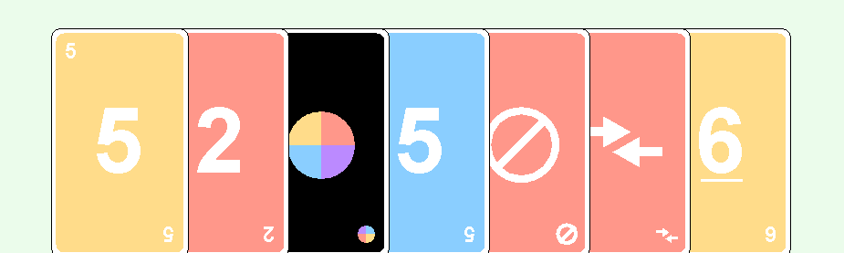
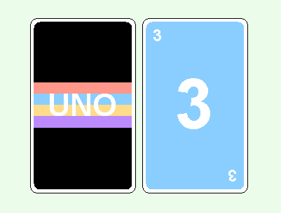
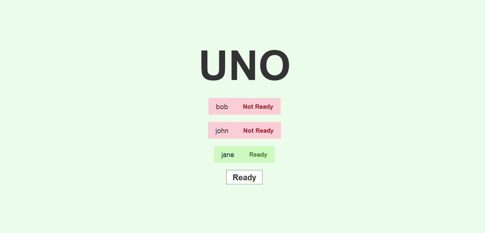

# Uno Game

## Description

This Uno game is a Java-based multiplayer application. It simulates the popular Uno card game, where multiple players can join a game hosted on a central server. Each player views only their own hand of cards and the last card played, while also seeing the number of cards remaining in the hands of other players.

The project demonstrates the application of the following programming concepts:

* Threading: To manage simultaneous actions in the game like player moves and server responses.
* Graphics: To create a dynamic and user-friendly graphical user interface (GUI) that shows the game state effectively to each player.
* Socket Networking: To facilitate real-time communication between clients and the server, ensuring that game state is consistent and actions are processed in real-time.

## Installation

1. Download the project files from this repository.
2. Compile the Java source files. You can compile the files using the following command:

```
javac *.java
```

3. Run the server program:

```
java Server
```
4. Run the client program on the same or different machines:

```
java Client
```

## Usage
Ensure the server is running before starting the client applications. Each client will connect to the server, allowing players to join the game. The GUI will guide each player through gameplay, updating in real-time based on other players' actions and server responses.

## Features

* Multiplayer Gameplay: Supports multiple players over a network.

* Secure Player Sessions: Each player's cards are kept private, with other players seeing only the count of remaining cards.

* Real-Time Game Updates: Leveraging socket networking to ensure that all players see game updates instantly.

* Interactive GUI: A clear and intuitive interface that displays personal hands, the discard pile, and updates from other players.

* Uno cards designed using Java Graphics



* Ready Page: A "Ready" page ensures that games begin only when all players have indicated their readiness.


## Bugs/Room for Improvement

* Limited Card Display Options: Only the current opponent's hand is visible at the top of the screen. Displaying cards sideways on the left and right sides of the screen proved challenging and is an area for potential improvement.

* No Plus Stacking: The game does not support stacking of +2 and +4 cards. When these cards are played, the effects are applied immediately to the next player, even if they also have a +2 or +4 card to play in response.
